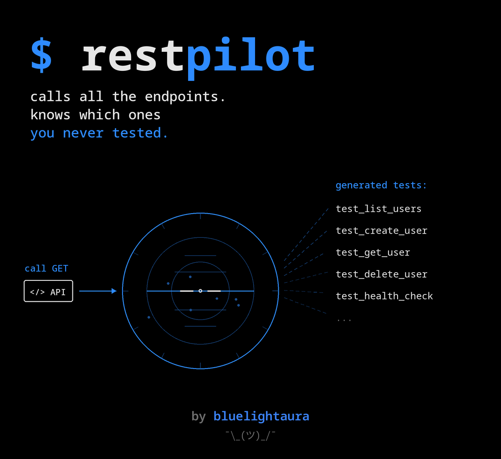

# RestPilot



RestPilot is a command-line client for REST APIs you did not write. There is no
GUI, no backend and no server of its own: configuration is YAML, the contract is
an OpenAPI document, and the output is either a formatted response in the
terminal or a runnable pytest suite on disk.

Testing someone else's API starts with the same hour of setup every time. The
base URL lives in one place and the token in another, and both change per
environment. `curl` invocations grow long and unreadable, and tokens end up in
the shell history. The specification lists forty endpoints and nobody knows
which of them are already covered. The first pytest suite is written by hand — a
client fixture, a base URL, a header, one test per endpoint — before a single
real assertion exists.

None of that is interesting work, and all of it is repeated on every new
project. RestPilot puts that hour into a handful of commands.

```bash
restpilot import-api openapi.yaml                  # read the contract
restpilot endpoints --search users                 # see what is available
restpilot env create local --base-url http://localhost:8000
restpilot env use local
restpilot call GET /api/v1/users/1                 # try it
restpilot generate-all                             # get a runnable pytest suite
restpilot test                                     # run it
```

Credentials are never part of that. Headers hold `${RESTPILOT_TOKEN}`
placeholders resolved from the process environment when the request is built,
the configuration file is written with `0600` permissions, and sensitive header
values are truncated in every line RestPilot prints.[^bodies]

[^bodies]: Masking covers headers. Response *bodies* are printed as received, so
    an API that echoes your credentials back inside the payload will show them
    on screen. See Boundaries and safety.

## Five things it does

### `env` — named targets

An environment is a base URL, a timeout, a TLS setting and a set of default
headers, stored under a name such as `local` or `stage`. A project-local
`./.restpilot.yaml` overrides the global `~/.config/restpilot/config.yaml` per
environment name, so a repository can pin its own targets without touching your
home directory.

### `call` — one request, readable output

Query parameters, JSON or raw bodies, per-request timeout and header overrides.
The response is printed as a summary — status, duration, content type — followed
by the body, pretty-printed and highlighted when it is JSON. At most two retries
are attempted, only for `GET`, `HEAD` and `OPTIONS`, and only on network errors
or `502`, `503` and `504`.

### `import-api` and `endpoints` — the contract

OpenAPI 3.x, from a file or a URL, YAML or JSON, tolerant of unknown fields,
with local `$ref` pointers resolved. The normalized form is stored once and then
listed, filtered and searched without re-reading the source.

### `generate-test`, `generate-all` and `test` — the suite

One readable pytest module per endpoint, with the expected status taken from the
specification and an example request body when the schema provides one. A
`conftest.py` exposing an `api_client` fixture is written next to them on first
generation. Existing files are never overwritten without `--force`.

### `coverage` — specification versus the tests you already have

The command compares the imported endpoints with the test files on disk and
names the ones nobody has covered yet. It counts hand-written tests too, and
`--fail-under` turns the report into a pipeline gate.

## Architecture

The CLI is a thin layer: it parses arguments, delegates, and renders. Every rule
lives in a package that can be imported and tested on its own.

```text
cli.py                    argument parsing, rendering, exit codes
├── config.py             file discovery and precedence (local over global)
├── environments/         environment CRUD, storage, ${VAR} resolution
├── api/                  request building, HTTP execution, response formatting
├── openapi/              loading (file or URL) and normalization into models
├── generators/           Jinja2 rendering of pytest modules, coverage matching
├── models.py             Pydantic models shared by every layer
├── exceptions.py         one error type per failure mode
└── utils/                secret masking and safe filesystem access
```

Failures are expressed as `RestPilotError` subclasses. The CLI turns them into a
one-line `Error:` message plus a hint; a traceback appears only with `--debug`.

## Installation

Requires Python 3.11 or newer. As a tool, in its own isolated environment:

```bash
pipx install 'restpilot[test] @ git+https://github.com/bluelightaura/restpilot.git'
```

The `test` extra pulls in pytest, which `restpilot test` shells out to. Without
it every other command still works and `restpilot test` says what is missing
instead of failing obscurely.

For development:

```bash
git clone https://github.com/bluelightaura/restpilot.git
cd restpilot
python -m venv .venv
source .venv/bin/activate
pip install -e '.[dev]'
```

Check the installation with `restpilot --help` and `restpilot version`.

## Quick start

```bash
# 1. Point RestPilot at an API
restpilot env create local --base-url http://localhost:8000 \
  -H Accept=application/json \
  -H 'Authorization=Bearer ${RESTPILOT_TOKEN}'
restpilot env use local

# 2. Provide the token through the environment, never through the config file
export RESTPILOT_TOKEN="example-token"

# 3. Call the API
restpilot call GET /api/v1/users/1

# 4. Import the contract and generate a suite
restpilot import-api examples/openapi.yaml
restpilot endpoints
restpilot generate-all
restpilot test

# 5. Check what is still untested
restpilot coverage --missing
```

## Environments

```bash
restpilot env create local --base-url http://localhost:8000
restpilot env create stage --base-url https://stage.example.com --timeout 20
restpilot env list
restpilot env use local
restpilot env show                # current environment, secrets masked
restpilot env delete local
```

- `--header`, `-H` adds a default header, `Name=value`, repeatable.
- `--force` replaces an existing entry instead of refusing.
- `--local` writes `./.restpilot.yaml` instead of the global file.
- `--no-verify` disables TLS verification, which is on unless you ask for it.

## Requests

```bash
restpilot call GET /health
restpilot call GET /api/v1/users -q limit=10 -q offset=0 --expected-status 200
restpilot call POST /api/v1/users \
  -H Content-Type=application/json \
  -j '{"name":"Alice","email":"alice@example.com"}' \
  --expected-status 201
restpilot call DELETE /api/v1/users/1
restpilot call GET /api/v1/users/1 --output response.json
restpilot call GET /health --verbose --timeout 5
```

- `--header`, `-H` — extra header, `Name=value`, repeatable.
- `--query`, `-q` — query parameter, `name=value`, repeatable, duplicates kept.
- `--json`, `-j` — JSON request body.
- `--data` — raw request body, mutually exclusive with `--json`.
- `--timeout` — override the environment timeout, in seconds.
- `--no-verify` — disable TLS certificate verification for this call.
- `--verbose`, `-v` — also print request and response headers, secrets masked.
- `--output`, `-o` — write the response body to a file.
- `--expected-status` — exit with code 1 when the status differs.
- `--env` — use another environment for this call only.

```text
Method:       GET
URL:          http://localhost:8000/api/v1/users/1
Status:       200 OK
Duration:     42 ms
Content-Type: application/json

{
  "id": 1,
  "name": "Alice",
  "email": "alice@example.com"
}
```

## OpenAPI

```bash
restpilot import-api examples/openapi.yaml
restpilot import-api https://example.com/openapi.json

restpilot endpoints
restpilot endpoints --method POST
restpilot endpoints --search users
```

```text
METHOD   PATH                     SUMMARY
GET      /api/v1/users            List users
POST     /api/v1/users            Create user
DELETE   /api/v1/users/{user_id}  Delete user
GET      /api/v1/users/{user_id}  Get user
GET      /health                  Service health probe
```

## Test generation

```bash
restpilot generate-test GET '/api/v1/users/{user_id}'
restpilot generate-test POST /api/v1/users --force
restpilot generate-all --method GET
restpilot test
restpilot test --marker smoke
restpilot test --path generated_tests
```

`restpilot test` runs pytest through `subprocess` with an argument list, never
with `shell=True`, and returns pytest's own exit code.

## Endpoint coverage

```bash
restpilot coverage
restpilot coverage --missing
restpilot coverage --method GET --search users
restpilot coverage --path api_tests --fail-under 80
```

```text
Endpoint coverage in generated_tests
METHOD   PATH                     STATUS   TEST
GET      /api/v1/users            missing  -
POST     /api/v1/users            covered  test_create_user.py
DELETE   /api/v1/users/{user_id}  missing  -
GET      /api/v1/users/{user_id}  missing  -
GET      /health                  covered  test_health_check.py

2 of 5 endpoints covered (40%)
```

A test counts as covering an endpoint when it carries the marker RestPilot
writes into the module docstring, so renaming or editing a generated file keeps
it recognized, or when it defines a test function named the way RestPilot would
name it, which lets hand-written tests count too. `--fail-under` exits with code
1 below the given percentage.

## Configuration

RestPilot reads two files: `~/.config/restpilot/config.yaml` as the global
configuration, and `./.restpilot.yaml` as a project file, looked up in the
current directory and its parents. The local file wins per environment name, and
its `current_environment` wins as well. `examples/restpilot.yaml` is a
ready-to-copy template.

```yaml
current_environment: local

environments:
  local:
    base_url: http://localhost:8000
    timeout: 10
    verify_ssl: true
    headers:
      Accept: application/json
      Authorization: Bearer ${RESTPILOT_TOKEN}

  stage:
    base_url: https://stage.example.com
    timeout: 20
    verify_ssl: true
```

Every `${VAR}` placeholder is resolved from the process environment when a
request is built. A missing variable is a clear error, not a request sent with a
literal `${VAR}` header.

```text
Error: environment variable RESTPILOT_TOKEN is referenced by the configuration but not set.
Export it before running the command, for example: export RESTPILOT_TOKEN=...
```

`RESTPILOT_CONFIG_HOME` overrides the global configuration directory, which is
what the test suite uses to stay out of your real home directory.

## Generated tests

`restpilot generate-test GET '/api/v1/users/{user_id}'` writes
`generated_tests/test_get_user.py`; see `examples/generated_test.py`.

```python
"""Generated by RestPilot for GET /api/v1/users/{user_id}.

Adjust the request data and assertions to match your scenario. RestPilot never
overwrites this file unless --force is passed.
"""

import httpx
import pytest


@pytest.mark.api
def test_get_user(api_client: httpx.Client) -> None:
    """Get user."""
    response = api_client.get("/api/v1/users/1")

    assert response.status_code == 200

    body = response.json()
    assert isinstance(body, dict)
```

The generator deliberately stays conservative: the expected status comes from
the specification, the body assertion only checks the documented shape, and no
dynamic value such as an id or a timestamp is ever hard-coded into an assertion.
The test name comes from `operationId` when the specification provides one,
otherwise from the method and path.

A `conftest.py` is created next to the tests on first generation and never
overwritten. It reads its configuration from the environment, so the suite stays
credential-free.

```bash
export RESTPILOT_BASE_URL="http://localhost:8000"
export RESTPILOT_TOKEN="example-token"
pytest generated_tests -m smoke
```

## Project structure

```text
restpilot/
├── restpilot/
│   ├── cli.py                     Typer commands
│   ├── config.py                  configuration discovery and merging
│   ├── models.py                  Pydantic models and HttpMethod
│   ├── exceptions.py              RestPilotError hierarchy
│   ├── api/
│   │   ├── client.py              HTTPX execution, retries, timing
│   │   ├── request_builder.py     URL, headers, query and body assembly
│   │   └── response_formatter.py  Rich rendering with masked secrets
│   ├── environments/
│   │   ├── manager.py             create / use / show / delete
│   │   └── storage.py             YAML read and write
│   ├── openapi/
│   │   ├── loader.py              file and URL loading
│   │   └── parser.py              normalization into models
│   ├── generators/
│   │   ├── pytest_generator.py    rendering and safe file writing
│   │   ├── coverage.py            specification vs. existing tests
│   │   └── templates/             Jinja2 templates
│   └── utils/
│       ├── secrets.py             ${VAR} expansion and masking
│       └── files.py               atomic writes, path traversal guard
├── tests/
│   ├── unit/                      configuration, parsing, masking, generation
│   ├── integration/               HTTP behaviour through respx
│   ├── cli/                       every command through CliRunner
│   └── conftest.py                isolated config home and fixtures
├── examples/
├── assets/                        README banner
├── .github/workflows/ci.yml
├── pyproject.toml
└── README.md
```

## Boundaries and safety

- Call only APIs you are authorized to call. RestPilot sends whatever you type,
  including destructive methods, without a confirmation prompt.
- Secrets are never stored in the repository or in the configuration: headers
  reference `${RESTPILOT_TOKEN}`-style placeholders resolved from the process
  environment at request time.
- Configuration files are written atomically with `0600` permissions.
- `Authorization`, `Proxy-Authorization`, `Cookie`, `Set-Cookie`, `X-API-Key`,
  `Api-Key` and `X-Auth-Token` are masked in every terminal output, including
  under `--verbose`.
- Response bodies are printed as received. Masking covers headers, so an API
  that echoes your credentials back in the payload — `httpbin.org/headers` does
  exactly that — will show them on screen. Treat body output as untrusted
  content.
- `.env` is git-ignored, together with `.restpilot.yaml` and `generated_tests/`.
- `restpilot test` executes pytest with an argument list and never with
  `shell=True`.
- Generated files are written through a path-traversal guard that refuses
  absolute paths and `..`.
- Every HTTP call has a finite timeout. Retries are capped at two and attempted
  only for safe methods.
- TLS verification is on by default; disabling it requires an explicit
  `--no-verify`, per call or per environment.

## Limitations

- OpenAPI 3.x only. Swagger 2.0 documents are rejected with a clear message.
- Only local `$ref` pointers are resolved; remote references are left untouched.
- Generated tests are scaffolding. They assert the status code and the
  documented body shape, not business rules.
- Only one specification is stored at a time per scope, project or global.
- No request history, no collections and no chaining between requests yet.
- Authentication is whatever you put in a header; there is no OAuth flow.

## Roadmap

Not implemented in the first version, in rough order of usefulness: request
history and replay; request collections; variables carried between requests
(`${response.id}`); JSON Schema validation of responses against the OpenAPI
document; contract testing; Postman collection import; Allure reporting; load
scenarios; a plugin system; a Textual TUI.

## Checks

```bash
pytest
ruff check .
ruff format --check .
mypy
pre-commit install
```

The suite is 259 tests behind a coverage gate of 90 per cent. It never touches
the real `~/.config/restpilot`: every test runs against a temporary
configuration home, and HTTP is mocked with `respx`, so no test needs a network
connection.

`.github/workflows/ci.yml` runs the same checks on every push and pull request
against Python 3.11, 3.12 and 3.13, and uploads `coverage.xml` as a build
artifact.

Licensed under [MIT](LICENSE).
